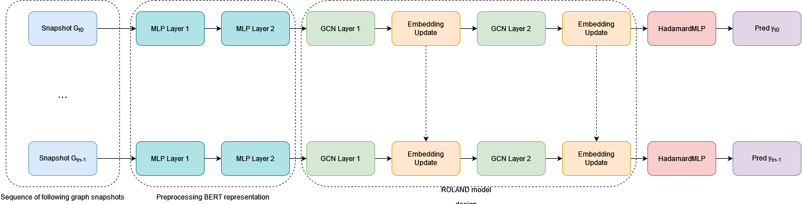

# Can Temporal Graph Networks be useful for change point detection?
Use of Temporal Graph Networks to analyze node states shift during a network shocking event in an online social network (OSN). 

The case study is a user migration from Steemit, the most well-known Blockchain-based OSN, to Hive, due to an hard-fork event.

This repository contains information, data and code behind the work: TBA

# Overview
Shocking events, characterized by the introduction of new information, have the potential to disrupt the distribution of temporal data in various domains. In the context of online social networks, network shocking events, i.e. events widely recognized by most network users, are worthy of attention since they significantly impact users' behavior and interactions. However, how users behave before, during, and after such events is still not clear. To address this gap we rely on the framework of graph representation learning, particularly focusing on Temporal Graph Networks (TGNs). In particular, we investigate the dynamics of node representations returned by TGNs during a network shocking event and examine the learning capacity of temporal graph learning in this context. We utilize a dataset from Steemit, a blockchain-based online social network, where a user migration event caused by a hard fork in the supporting blockchain serves as the network shocking event. Our findings demonstrate that both the prediction performance and node representation are influenced by the occurrence of the shocking event. We observe shifts in node representations, indicating changes in individual users' behavior during the event. Furthermore, group-centric analysis reveals changes in behavior and memberships among similar users during different transition periods. Additionally, we find a level of polarization in node representations caused by the shocking event, which gradually diminishes over time, resulting in more evenly distributed dimensions of node representations months after the event. This work contributes to a deeper understanding of temporal graph learning dynamics during network shocking events, highlighting their potential for change point detection and shedding light on the behavior of networked systems in the face of significant events.

# Dataset
Due to privacy reasons on personal data like username and textual content, we can't release the dataset related to Steemit. To patch this problem, we provide an anonymized version of our data. This version represents the final mathematical objects that are use to feed the models. For data gathering you can refer to the [Steemit API documentation](https://developers.steem.io/). 

Data related to the period affected by the shocking event are available in this repo in the zip `steemit-hardfork-data.zip`. To use them in the notebook of experiments, you need to unzip the file in a folder with the same name on the same level. For data related to the "stable" period in 2016 you can refer to PAPER SUBMITTED at Journal of Machine Learning.

# Experiments
The notebook `TGN-SteemitHardFork.ipynb` contains all the materials to reproduce the experiments on the period affected by the shocking event. The figure below shows the running architecture of the TGN model. 

. 

We report the architecture configuration in the following table: 

| Layer                     | input_channels | output_channels |
|---------------------------|----------------|-----------------|
| Preprocessing layer (MLP) | 384            | 256             |
| Preprocessing layer (MLP) | 256            | 128             |
| Graph Convolution (GCN)   | 128            | 64              |
| Embedding Update (GRU)    | 64             | 64              |
| Graph Convolution (GCN)   | 64             | 32              |
| Embedding Update (GRU)    | 32             | 32              |
| Decoder (HadamardMLP)     | 32             | 2               | 

We report the configuration of hyperparameters for the future link prediction task in the following table: 

| Hyperparameter | Value |
|----------------|-------|
| Optimizer      | Adam  |
| Learning rate  | 0.01  |
| Weight Decay   | 5e-3  |
| Epochs         | 50    |

